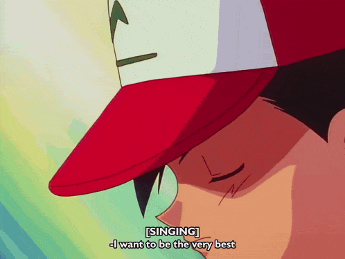

---
# the default layout is 'page'
icon: fas fa-info-circle
order: 4
---

I'm currently in my final year of undergrad. I'm in love with music. So much so that I feel a life of song writing would be heaven. Why am I working towards a career in tech you ask? Freedom! I don't want my music to be dictated by what sells and what doesn't, I might grow to hate music then. Plus, AI really fascinates me. Its sheer power in automation and adaptability as a mathematical model never ceases to amaze me. 

And since I'm here, I wanna be the very best at it!

I want to travel to the Antarctic once I save enough up for it. Math, anime and music makes me happy. I've refused to fix my chuunibyou, life's more fun that way. Hope you find what you're looking for in this blog!

I use arch btw.
